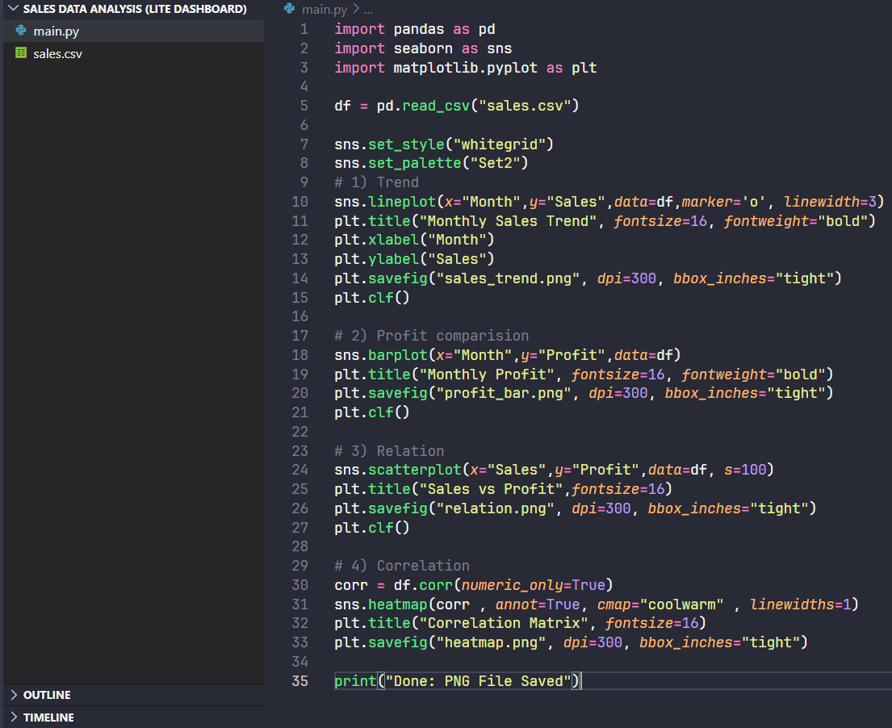
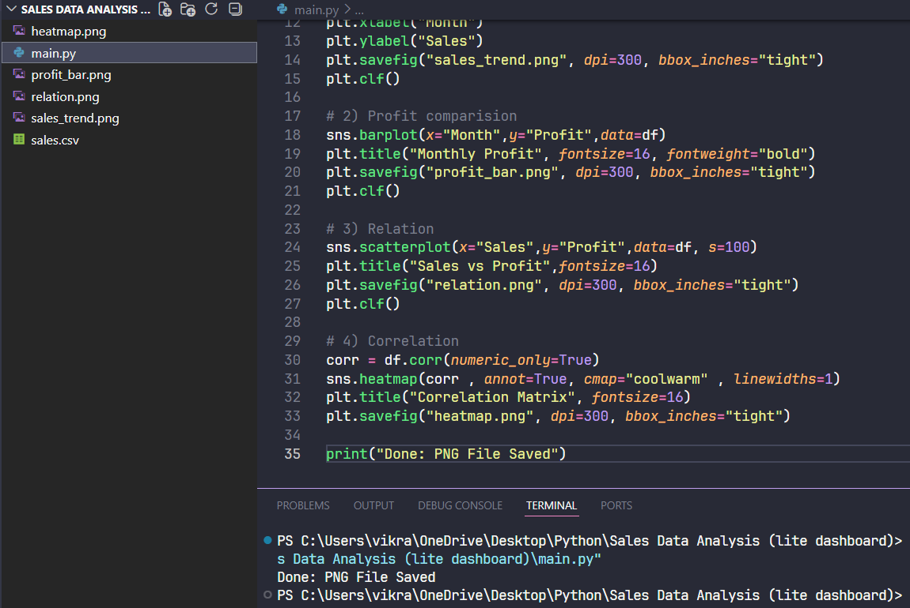
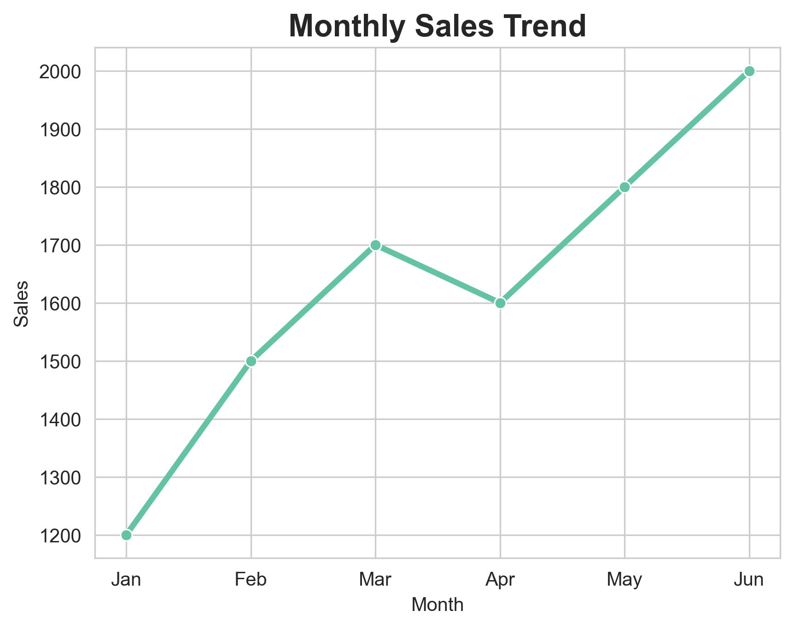
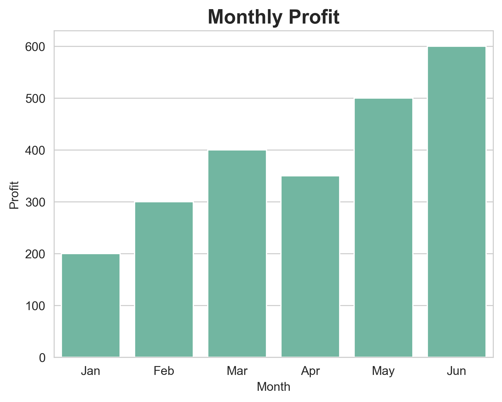
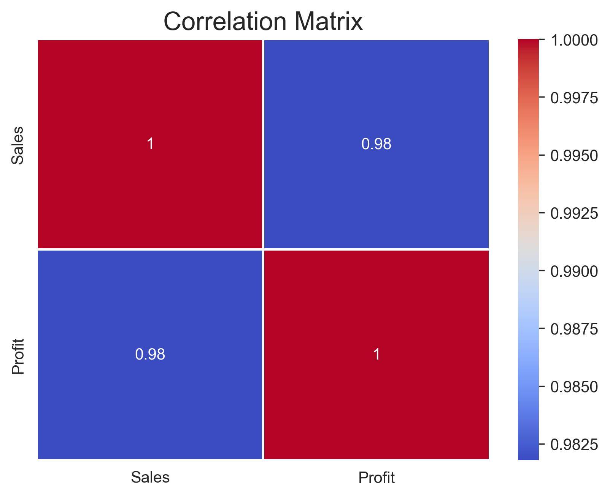
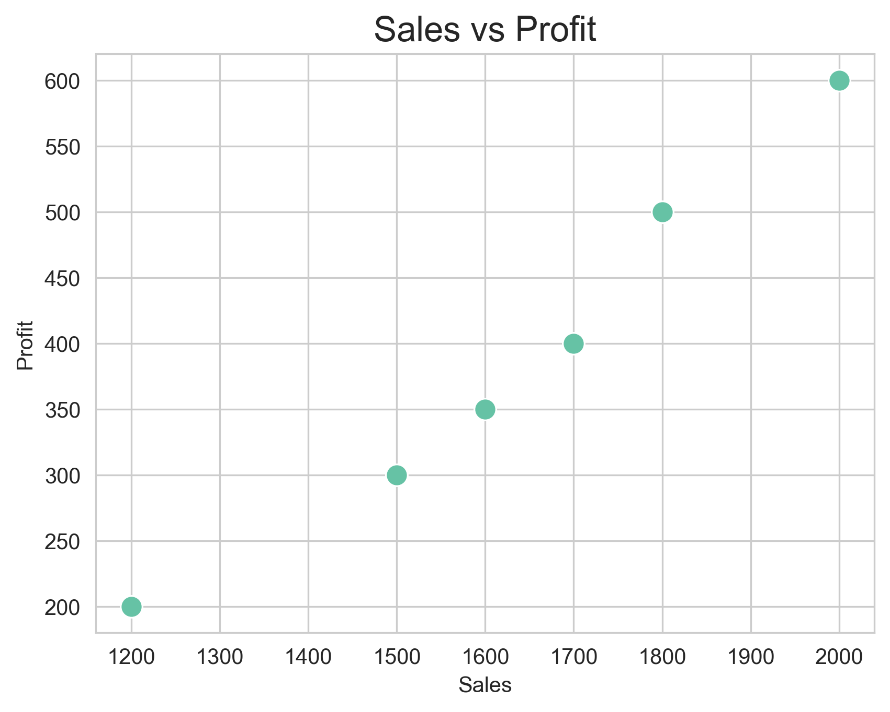

# 📊 Sales Data Analysis Dashboard

This project analyzes sales data using Python.

## 🚀 Tools Used
- Pandas
- Matplotlib
- Seaborn

## 📈 Features
- Monthly sales trend
- Profit analysis
- Sales vs Profit relation
- Correlation heatmap

## 📂 Project Structure
- main.py → main code
- sales.csv → dataset
- .png files → graphs
- before_after → styling comparison

## 🔄 Before vs After

 

## 📊 Dashboard Preview

## 👨‍💻 Author
Vikram Prajapati
